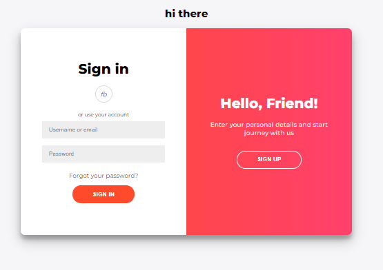
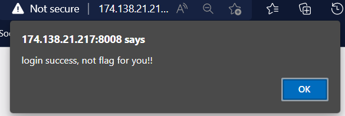
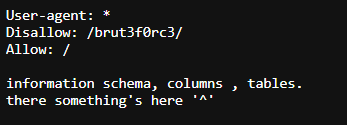
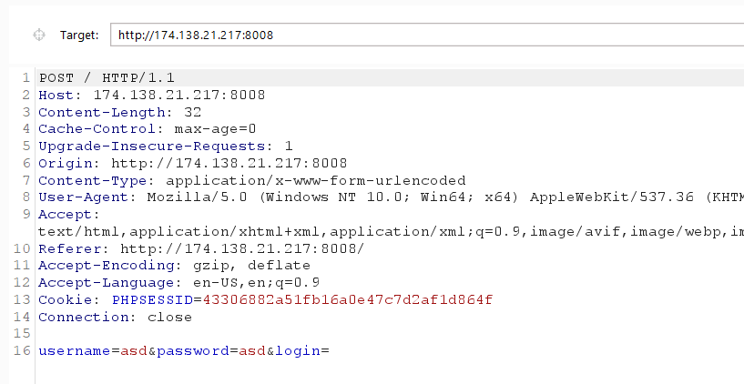
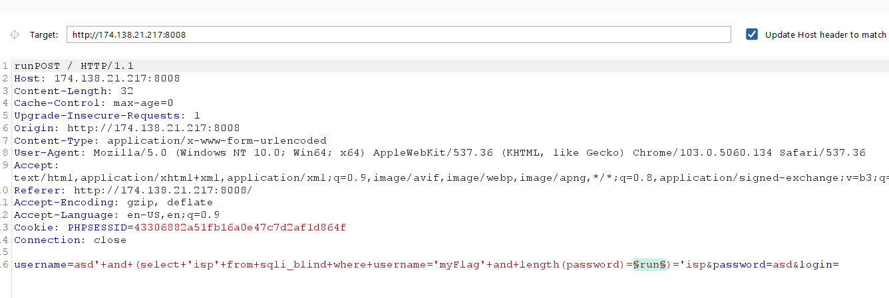
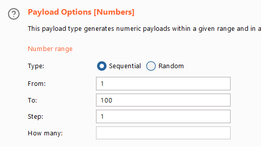
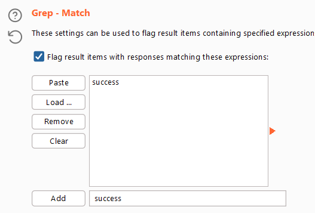
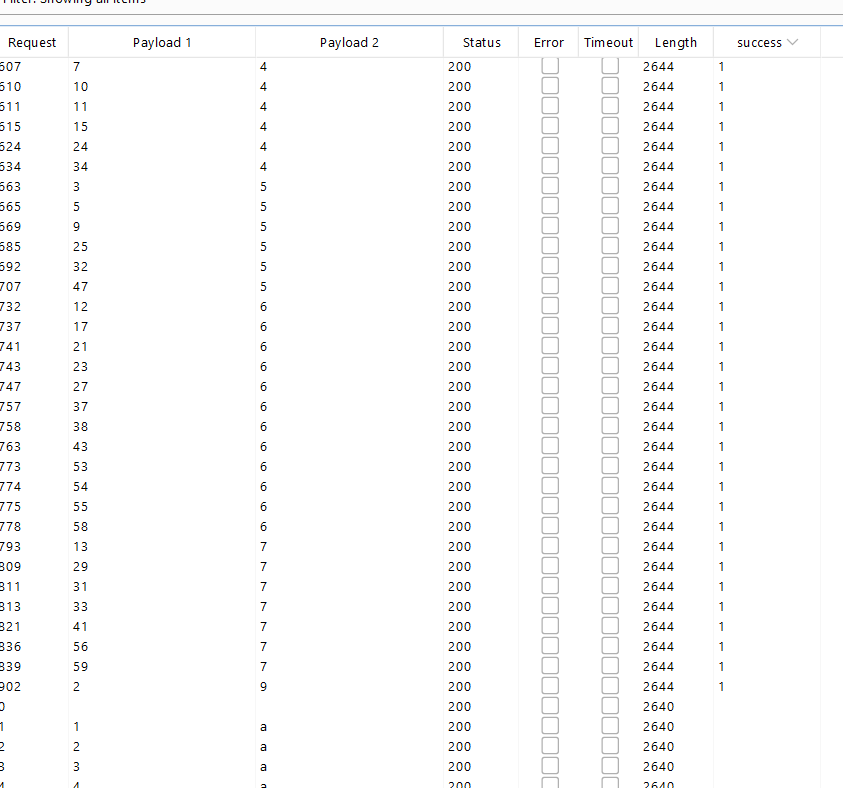

# SQLi Blind

# Bước 1 
> Mới đầu vào, đạp vào mắt là trang đăng kí, đăng nhập. Chưa cần phải nghĩ tới hack, hãy sử dụng web như một client chân chính.
- >

> Đầu tiên là tạo tài khoản. Tạo 1 username: `asd`, password: `asd`. Sau đó đăng nhập, ta có 1 `alert` hiện ra:
- >

> `login success` và không có flag, rồi sao? :(  
> Để ý ở phần `Footer`, cho `robots.txt`
- > 
>Truy cập vào ta được gợi ý 
- >
- >Có 1 file ẩn :  `brut3f0rc3`
- > Có thứ gì đó trong :`'information schema, columns , tables'`  Vậy là phải tìm được `column_name` trong `columns`, `table_name` trong `tables`. Ok vào file `brut3f0rc3` trước đã

# Bước 2

- ><image src="./images/5.png" width="50%">  Vào xong thấy ối dồi ôi luôn :(

> Trong khi trải nghiệm web, bạn sẽ phát hiện ra, các button order sản phẩm đã tạo ra 1 truy vấn có thể nhìn thấy trên Url. Các truy vấn này có thể được truy vấn tới tới databases, hoặc là không :( 
- <image src="./images/6.png" width="70%">
- Khi nhấn `women`  truy vấn `'?category=women'` được gọi.

> Mặc dù không chắc, nhưng ít nhất có thể khai thác ở đây vì method GET đập lù lù vào mắt :(   Ta thấy các sản phẩm được xuất ra sau khi truy vấn, như vậy nếu như ở đây có lỗ hổng, các thông tin chúng ta cần biết như `'column_name'` `'table_name'` cũng sẽ được hiện ra đây ở đây, nếu như select đúng :>

> Vậy bây giờ bắt đầu như nào? :(
- > Bật BurpSuite lên đã rồi làm gì thì làm :(
- > Ném request vào Repeater, ta thấy  số cột trả về là `4`
- > 
- > Biết được số cột trả về là 4, nếu như ta có thể ta có thể tiêm được `union` vào truy vấn này, ta có thể tìm kiếm thông tin như `colum_name,table_name` trong database `information_schema` như đã được gợi ý.

> Vậy kiểm tra xem `union` có thực sự hoạt động hay không 
> Ta thử với payload sau:  `category=women'union+select+null,null,null,null%23`
- ><image src="./images/8.png"> 
   >Sản phẩm trả về gồm 4 sản phẩm của `women` và 1 sản phẩm `NULL` được select. Như vậy có thể khai thác bằng cách tiêm `union` vào truy vấn.
- > Trong BurpSuite cũng có thể thấy, số hàng trả về là 5
  - > <image src="./images/9.png"> 
- > Kiểm tra giá trị trả về, xem cột nào trong 4 cột chấp nhập kiểu chuỗi, từ đó có thể tiêm payload vào. Làm như sau: 
  - > Với 2 đối số đầu tiên, ta thay `Null` bằng chuỗi `ngn`, nhấn send và sản phẩm của `NULL` cũng trả ra 2 chuỗi `ngn`. vậy ta sẽ khai khác theo 2 đối số này
  - > <image src="./images/10.png">

> Vậy thì bây giờ làm sao để tìm được Flag? Chắc chắn cái bảng chứa Flag nó sẽ nằm ở đâu đó trong `tables`, cột chứa Flag sẽ nằm đâu đó trong `columns`.
> Vậy thì tiếp tục đi tìm các `table_name` và `column_name` thôi. 
> Nhưng tìm như nào? :(  
Tìm `table_name` trong `tables` và `column_name` trong `columns` 

> Tìm `table_name` trong `tables`: 
 - > Ta có truy vấn:  `category=women'union+select+table_name,null,null,null+from+information_schema.tables%23`
   > Ném payload lên truy vấn ta thấy một đống tên bảng được hiện ra:
   - > <image src="./images/11.png" width="70%">
   - > Giờ thì tìm bảng nào có ích thôi :(
   - > Khi kéo đến cuối ta tìm được 2 bảng khả nghi là `products` và `sqli_blind`  
      - `products` thì chắc là bảng chứa sản phẩm
      - `sqli_blind` có thể là bảng chứa flag. Note lại tên bảng là `sqli_blind` cho khỏi quên :(
> Giờ thì đi tìm tên cột:
 - > Ta có truy vấn:  `category=women'union+select+column_name,null,null,null+from+information_schema.columns%23` 
    > Ném payload lên truy vấn ta thấy một đống tên cột được hiện ra, kèm với đó là rất nhiều cột fake, kéo xuống dưới cùng, ta tìm được các cột quan trọng như:
    - > `username`,` password` => Flag chắc chắn nằm trong đây luôn =))
    - > `category`,` image`,` price`

> Giờ thì sao?  
> Ta đã tìm được tên bảng là `sqli_blind`, tên 2 cột là `username`,` password`. 
> Cùng với 2 đối số chấp nhận kiểu string, `select` chúng ra thôi chứ còn gì nữa :)) 
> =>Payload: `category=women'union+select+username,password,null,null+from+sqli_blind%23`

> Nhưng đời không như là mơ, cứ tưởng thế là xong thì auth lại chặn truy vấn, cũng phải thôi, đề bài là `sqli_blind` mà :(  
 - >Ta thu được username = `myFlag`
 - > 

 > Hiện tại, ta đang có `table_name` = `sqli_blind`, `username` = `myFlag` và `password` = `''` 
 > Nhiệm vụ bây giờ là đi tìm `password`. 
 > Auth nói là không còn gì ở đây nữa, thì bạn cứ tạm tin là như vậy đi, với lang thang ở trang này cũng đã quá đủ rồi, trở lại trang đăng ký đăng nhập để khai thác `Blind` nào :(  

 # Bước 3

> `Blind` nôm na là cách để đưa dữ liệu vào 1 hòm đen mà ta không biết trong đó nó xử lý thế nào, bằng cách đưa tất cả các trường hợp có thể có vào và so sánh kết quả đầu ra của chúng với điều kiện đúng, nếu đầu ra khớp với điều kiện đúng thì tương ứng với dữ liệu đầu vào của nó cũng là đúng. Nghe giống `bruteforce` nhỉ :( .  

> Tức là bây giờ ta cần `bruteforce` ra `password` 
>Nhưng trước hết ta cần biết độ dài của `password` bằng bao nhiêu. 
 - >Đưa request vào repeater để kiểm tra payload có chạy chuẩn không :(
    - > Ta đang dùng `username, password` đã được đăng kí, nên nếu một truy vấn đúng thì nội dung trả về phải có message `login success, not flag for you`
     - ><image src="./images/17.png">
     - >Kết hợp Mệnh đề `and` để đảm bảo truy vấn đúng thì `select` phải đúng.
     - >Giả sử truyền vào một `username` sai, kết quả trả về sẽ là: 
     - >

> Vậy là ta đã xác định được truy vấn đúng, tiến hành đưa request vào intruder, để tìm độ dài `password`.
 - > Trong intruder 
 - > Tạo payload như trong `repeater` và thêm nội dung cần kiểm tra là độ dài `password`: 
   - > `username=asd'+and+(select+'isp'+from+sqli_blind+where+username='myFlag'+and+length(password)=§1§)='isp&password=asd&login=`
   - >  
   - > Thêm 1 biến chạy như trong hình.
   - > Cho biến `run` chạy từ 1 -> 100 (chắc password chỉ tầm 100 đổ về thui )     
     - > 
   - > Nếu như độ dài của `password` đúng bằng giá chị chạy cả biến `run` thì nội dung trả về sẽ là `login success`, nếu không thì là `username or password is wrong`.
   - > Vậy để dẫn nhận biết là request gửi đi là đúng hay sai, ta thêm `grep-match` với nội dung `'success'`
     - >
> Nhấp `start attack`

 - > Tìm hàng nào có cột `success`=`1`. Vậy là đã tìm được độ dài của `password` = `60`
   - >

 # Bước 4

> Tiếp theo đi tìm `password` bằng cách cắt từng kí tự của `password` từ ký tự đầu đến ký tự cuối, để đem so sánh với bảng chữ cái từ `a->z` và `0->9`. 
> Mục đích của việc này là ta chỉ có thể đem so sánh ký tự, kết quả đúng thì trả về `login success`, sai thì `username or password is wrong`. 
> Vậy nên để bruteforce được kiểu này, thì việc tiên quyết phải làm là đi tìm độ dài `password` :(

> Payload: `username=asd'+and+(select+substring(password,§1§,1)+from+sqli_blind+where+username='myFlag')='§c§&password=asd&login=`
   - >
  - > Biến `§1§` đề cắt kí tự thứ `§1§` ra, `password` như 1 xâu ký tự, mỗi ký tự sẽ được đem so sánh với biến `§c§`
  - > Biến `$1$` chọn payload type là `Numbers` chạy từ `1->60`, vì length password = 60;
  - > Biến `§c§` chạy payload type là `` từ `a->z, 0->9`
  - > Mỗi một ký tự được cắt ra bới chỉ số `$1$` sẽ được so sánh với mỗi giá trị trong `a->z, 0->9`
  - > Chọn kiểu tấn công là `cluster bomb`
  - > Nhớ `grep-match` cụm từ `success` để biết ký tự nào được `blind` đúng.
  - > Cuối cùng nhấn `start-attack` 

  - >Nếu bạn không có burpPro thì khoảng vài tiếng sẽ cho ra kết quả sau:
   - >
   - > Loại bỏ tất cả các hàng không match được với `success`
   - > Sắp xếp lại `payload1` từ 1->60 đi kèm với với `payload2`
    - > 
    - > Những 60 ký tự cơ, sau đó thì copy lên <a href="https://kt.gy/tools.html#conv/ISPCTF%7BBl1nd_brut3f0rc3_01fg6%7D">kt.gy</a> để dehex vậy là ta có Flag :>
    - >

>Flag: `ISPCTF{Bl1nd_brut3f0rc3_01fg6}`

